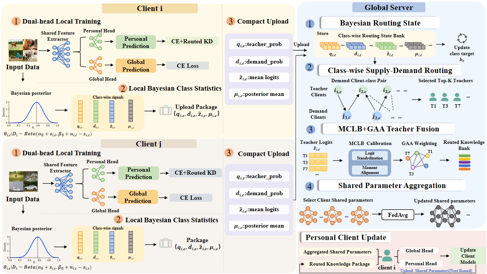

# FedCKR: Class-wise Knowledge Routing for Bridging Knowledge Deficiency in Personalized Federated Learning

<p align="center">
    
</p>

This repository provides code and reproducibility resources for **FedCKR**, a class-wise knowledge routing framework for personalized federated learning under label-skewed non-IID data.

## Installation

An example environment:

```
Ubuntu 24.04
Python 3.12
CUDA 13.0
PyTorch 2.8.0
Torchvision 0.23.0
```

Install the required dependencies:

```bash
pip install -r requirements.txt
```

## Datasets Preparation

We evaluate FedCKR on four benchmark datasets:

- CIFAR-10
- CIFAR-100
- FashionMNIST
- SVHN

The client data are partitioned using a Dirichlet distribution to construct label-skewed non-IID settings.

The datasets can be downloaded through `torchvision` or prepared in the local data directory.

Example directory structure:

```
data/
├── cifar10/
├── cifar100/
├── fashionmnist/
└── svhn/
```

## Training

FedCKR is designed for personalized federated learning under label-skewed non-IID data.

Training scripts and implementation details are provided in this repository.

## Evaluation

The evaluation includes:

- Personalized Accuracy
- Weak-Class Accuracy
- Worst-Client Accuracy
- Global Accuracy

## Acknowledgment

We thank the authors of related federated learning methods and open-source libraries.

## LICENSE

This repository is released under the MIT License.
